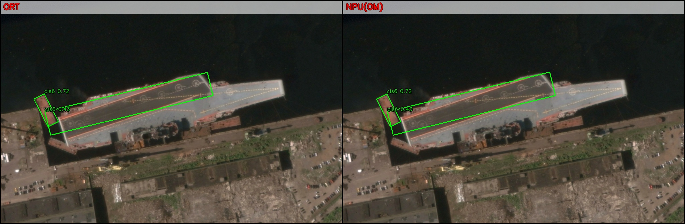

> 打个广告：模型部署优化、模型加速（云端、端侧、边缘侧）相关需求欢迎联系 `zhuilewang@163.com` ，支持对公/可开发票  
> 支持设备：昇腾/海思/瑞芯微/算能/高通/苹果/arm/英伟达/英特尔等，gpu/npu/cpu都可以支持


# two-staged 旋转目标检测模型 在昇腾设备上的部署

开源 two-staged 旋转目标检测模型 **从 `end2end_simp.onnx`、自定义算子、算子替换、`OM`转换 到 OM推理 与 可视化** 的完整流程。  

本项目不包含 `op_host/op_kernel/framework` 全量Ascend C算子源码，但保留了 **算子替换相关源码与Ascend C编译的算子安装包**（`Where_2`、`Gather_40` 改写脚本）用于复现图改写与精度对齐。    

为避免超大文件进入 Git，ONNX 模型文件改为通过 GitHub Release 资产分发。

## 效果图示例



## 1. Git 仓库与 Release 资产拆分

- Git 仓库内仅提交以下内容：
  - `standalone_end2end_simp_runner/`
  - `README.md`
  - `run_verify_310b4.sh`
- 大体积模型文件通过 GitHub Release 资产分发：
  - `open_source_release_20260222_release_ascend_c_onnx_20260222.tar.gz`
- 上述 Release 资产解压后会生成：`standalone_end2end_simp_runner/ascend_c_onnx/`。

## 2. 首次使用（必须）：下载 Release 并解压到指定位置

```bash
REPO_ROOT=/path/to/open_source_release_20260222
cd "$REPO_ROOT"

# 1) 下载 GitHub Release 资产（将 URL 替换成你的实际发布地址）
wget -O open_source_release_20260222_release_ascend_c_onnx_20260222.tar.gz \
  https://github.com/thb1314/ascend_cv_rotated_op/releases/download/v20260222/open_source_release_20260222_release_ascend_c_onnx_20260222.tar.gz

# 2) 可选：校验下载完整性（SHA256）
echo "d980f69cc7d7b7d17f07748897e12bba10f2b00399b19bca0e1574aed9741868  open_source_release_20260222_release_ascend_c_onnx_20260222.tar.gz" | sha256sum -c -

# 3) 解压到 standalone runner 目录（解压后会得到 ascend_c_onnx/）
tar -xzf open_source_release_20260222_release_ascend_c_onnx_20260222.tar.gz \
  -C "$REPO_ROOT/standalone_end2end_simp_runner"

# 4) 校验关键文件存在
test -f "$REPO_ROOT/standalone_end2end_simp_runner/ascend_c_onnx/end2end_simp.onnx"
test -f "$REPO_ROOT/standalone_end2end_simp_runner/ascend_c_onnx/end2end_simp.only_dets_labels.ort_tmp.onnx"
```

说明：
- `run_verify_310b4.sh` 和 workflow 默认读取 `standalone_end2end_simp_runner/ascend_c_onnx/` 下的 ONNX。
- 如果未先执行本节解压，后续 ATC/OM/ORT 流程会报缺少 ONNX 文件。

## 3. 包含与不包含

- Git 仓库包含：流程脚本、ONNXRuntime 运行库、ORT 自定义算子 `.so`、示例图片、各 SOC 的 `.run` 安装包。
- GitHub Release 资产包含：`ascend_c_onnx/` 下 ONNX 模型文件。
- 不包含：`ascend_c_onnx` 下各算子完整源码工程。
- 说明：`Ascend310P`（无后缀）在 910 构建环境失败，因此仅提供 `Ascend310P1/P3`。

## 4. 运行环境依赖（Conda Base）

### 4.1 版本依赖（CANN / 驱动 / 固件）

以下为本仓库在当前设备上的**已验证组合**（Ascend310B4 / Atlas 200I A2）：

- CANN（ATC/Compiler）：`8.5.0`
  - 参考：`/usr/local/Ascend/cann-8.5.0`、`/usr/local/Ascend/cann-8.5.0/compiler/version.info`
- Driver / npu-smi：`25.5.0`
  - 参考：`/var/davinci/driver/version.info`、`npu-smi info`
- Board Firmware：`6.2.2.0.b133`
  - 参考：`npu-smi info -t board -i 0`

建议：
- 目标机器尽量使用与上述一致的 CANN + Driver + Firmware 组合。
- 至少保证 `npu-smi info -t board -i 0` 中 `Software Version` 与 `Firmware Version` 正常可读，再执行 ATC 和 OM 推理。

版本自检命令：

```bash
cat /usr/local/Ascend/cann-8.5.0/compiler/version.info
cat /var/davinci/driver/version.info
npu-smi info -t board -i 0
```

### 4.2 系统依赖

- CANN/ATC：已安装并可用（示例路径：`/usr/local/Ascend/cann-8.5.0/bin/atc`）。
- Ascend 运行环境：`/usr/local/Ascend/ascend-toolkit/latest/bin/setenv.bash` 可 source。
- 常用工具：`bash`、`screen`、`sha256sum`。

### 4.3 Python 依赖（在 `conda base`）

```bash

conda activate base

python -m pip install -U numpy onnx onnxruntime opencv-python
python -m pip install onnx_graphsurgeon --index-url https://pypi.ngc.nvidia.com
```

说明：
- 本仓库脚本默认使用 `conda base`（例如 `run_verify_310b4.sh`、workflow 脚本）。
- 若目标机器没有 conda，先安装 Miniconda，再按上面命令安装依赖。

## 5. 算子包安装方式（必须）

以下以 `Ascend310B4` 为例，其他 SOC 只需替换 `SOC_VERSION`：

```bash
REPO_ROOT=/path/to/open_source_release_20260222
cd "$REPO_ROOT/standalone_end2end_simp_runner"

SOC_VERSION=Ascend310B4
INSTALL_BASE="$PWD/.ascend_custom_opp_mmrotate_all_ops"
RUN_PKG="$PWD/opp_pkgs/mmrotate_all_ops_frameworklaunch_${SOC_VERSION}_custom_opp_ubuntu_aarch64.run"

# 可选：先校验安装包
sha256sum -c "$PWD/opp_pkgs/SHA256SUMS.txt" --ignore-missing

# 重装（确保当前测试使用本包内算子）
rm -rf "$INSTALL_BASE"
"$RUN_PKG" --quiet --install-path="$INSTALL_BASE"

export ASCEND_CUSTOM_OPP_PATH="$INSTALL_BASE/vendors/customize"
export LD_LIBRARY_PATH="$ASCEND_CUSTOM_OPP_PATH/op_api/lib:$ASCEND_CUSTOM_OPP_PATH/framework/onnx:$PWD/onnxruntime-linux-aarch64-1.11.0/lib:${LD_LIBRARY_PATH:-}"
```

可用 SOC 包位于 `standalone_end2end_simp_runner/opp_pkgs/`：
- `Ascend310B1/B2/B3/B4`
- `Ascend310P1/P3`
- `Ascend910B/910B1/910B2/910B3/910B4`
- `Ascend910_93`

## 6. 快速开始（一键）

```bash
REPO_ROOT=/path/to/open_source_release_20260222
cd "$REPO_ROOT"

conda activate base

# 先确保已执行“第 2 节：下载 Release 并解压”
# 重新安装本包算子 + ONNX 替换 + screen+ATC + OM/ORT 对比 + 可视化
bash run_verify_310b4.sh
```

## 7. 标准流程（ONNX -> OM -> 对比）

1. 生成 ATC 友好 ONNX（含必要替换）  
`standalone_end2end_simp_runner/workflows/end2end_fullgraph_om_vis/prepare_fullgraph_onnx.py`

2. 用 `screen` 后台转 OM  
`standalone_end2end_simp_runner/workflows/end2end_fullgraph_om_vis/build_full_om_in_screen.sh`  
`standalone_end2end_simp_runner/tools/run_atc_in_screen.sh`

3. 跑 OM、补跑/复用 ORT、产出指标与可视化  
`standalone_end2end_simp_runner/workflows/end2end_fullgraph_om_vis/run_compare_and_visualize.sh`  
`standalone_end2end_simp_runner/scripts/fill_ort_vis_and_benchmark.py`

### 7.1 `atc_ready_full` 的 6 类主算子替换

`prepare_fullgraph_onnx.py` 会先调用 `scripts/patch_end2end_simp_pipeline.py --pipeline atc_ready_full`，核心主替换如下：

1. `MMCVMultiLevelRoiAlign` -> `NPUMMCVMultiLevelRoiAlign`
2. `MMCVMultiLevelRotatedRoiAlign` -> `NPUMMCVMultiLevelRotatedRoiAlign`
3. `GridPriorsTRT` -> `GridPriorsNPU`
4. `TRTBatchedRotatedNMS` -> `NPUBatchedRotatedNMS`
5. `TopK` -> `AscendTopK`
   - 限制：当前仅替换 `axis=0` 的 `TopK`
   - `k/largest/sorted` 会转成 `AscendTopK` 的显式属性
6. `NonMaxSuppression`（默认节点名 `/NonMaxSuppression`） -> `NPUNonMaxSuppressionOrt`
   - 会从原 NMS 输入中提取 `max_output_boxes_per_class/iou_threshold/score_threshold` 并写入新节点属性

说明：
- 在 NMS 替换后，脚本还会做一个配套图修复：将特定 `Squeeze` 改为 `Reshape`，用于稳定 NMS 后续 shape 链路（不属于新增算子类型，但属于必要图修复）。
- `atc_ready_full` 同时会做若干 ATC 兼容处理（如 `Reduce*` 自动补 `axes`、部分 shape/value_info 修正），这些属于图修补，不计入“6 类主算子替换”。

### 7.2 额外图改写（Where_2 / Gather_40）

在 `prepare_fullgraph_onnx.py` 中，默认还会执行两类额外改写（`--enable-where2-maskarith`、`--enable-gather40-slice` 默认开启），目标是提升 ATC/OM 兼容性并保持数值等价：

1. `Where_2` -> `Cast + Mul + Sub`（脚本：`tools/patch_where2_maskarith.py`）
   - 目标节点：默认 `/Where_2`
   - 约束：`else` 分支来自 `Add(then_x, pi2_const)`
   - 替换：
     - `mask_f32 = Cast(cond, FLOAT)`
     - `mask_pi2 = Mul(mask_f32, pi2_const)`
     - `out = Sub(else_y, mask_pi2)`
   - 等价性：
     - `cond=1` 时：`out = then_x`
     - `cond=0` 时：`out = then_x + pi2_const (= else_y)`

2. `Gather_40` -> `Slice + Squeeze`（脚本：`tools/patch_gather40_to_slice_squeeze.py`）
   - 目标节点：默认 `/Gather_40`
   - 约束：`Gather` 必须是 `axis=1` 且索引是标量 `-1`
   - 替换：
     - `Slice(data, starts=[4], ends=[5], axes=[1], steps=[1])`
     - `Squeeze(axes=[1])`
   - 含义：等价于“取第 2 维最后一列”。

3. 产物命名（便于排查）
   - 基础模型：`npu_full.atc_ready_full.onnx`
   - 应用 Where 改写后：`npu_full.atc_ready_full.where2_maskarith.onnx`
   - 再应用 Gather 改写后：`npu_full.atc_ready_full.where2_maskarith.gather40_slice.onnx`
   - 全步骤清单：`fullgraph_prepare_manifest.json`

脚本参数总览见：
- `standalone_end2end_simp_runner/README_SCRIPT_ARGS.md`

## 8. 自定义算子说明（含输入输出 Shape）

以下 shape 为当前流程实测（固定输入 `input: [1, 3, 672, 1024]`）。

### 8.1 `NPUMMCVMultiLevelRoiAlign`
- 功能：多层 FPN 的轴对齐 RoIAlign，输出固定大小 RoI 特征。
- 输入：
  - `rois`: `[2000, 5]`（`[batch_id, x1, y1, x2, y2]`）
  - `feat0`: `[1, 256, 168, 256]`
  - `feat1`: `[1, 256, 84, 128]`
  - `feat2`: `[1, 256, 42, 64]`
  - `feat3`: `[1, 256, 21, 32]`
- 输出：
  - `y`: `[2000, 256, 7, 7]`
- 关键属性：`output_height/output_width`、`sampling_ratio`、`aligned`、`finest_scale`、`featmap_stride0~3`。

### 8.2 `NPUMMCVMultiLevelRotatedRoiAlign`
- 功能：多层 FPN 的旋转框 RoIAlign（含角度）。
- 输入：
  - `rois`: `[2000, 6]`（常见为 `[batch_id, cx, cy, w, h, angle]`）
  - `feat0..feat3`: 同 6.1
- 输出：
  - `y`: `[2000, 256, 7, 7]`
- 关键属性：`clockwise`、`aligned`、`sampling_ratio`、`roi_scale_factor`、`finest_scale`、`featmap_stride0~3`。

### 8.3 `GridPriorsNPU`
- 功能：按特征图尺度生成先验框网格（priors/anchors）。
- 输入（单个 level 示例）：
  - `base_anchor`: `[3, 4]`
  - `feat_h`: `[168]`（不同层可为 `[84]`/`[42]`/`[21]`）
  - `feat_w`: `[256]`（不同层可为 `[128]`/`[64]`/`[32]`）
- 输出：
  - `priors`: `[H*W*3, 4]`  
    例如 level0：`[129024, 4]`；其它层典型：`[32256, 4]`、`[8064, 4]`、`[2016, 4]`。
- 关键属性：`stride_h/stride_w`（控制先验中心间距与尺度映射）。

### 8.4 `NPUBatchedRotatedNMS`
- 功能：批量旋转框 NMS，输出最终检测框与标签。
- 输入：
  - `loc`: `[1, 2000, 1, 5]`
  - `conf`: `[1, 2000, 15]`
- 输出：
  - `dets`: `[1, 1000, 6]`（常见为框参数 + score）
  - `labels`: `[1, 1000]`
- 关键属性：`score_threshold`、`iou_threshold`、`topk`、`keep_topk`、`num_classes`。

### 8.5 `AscendTopK`
- 功能：候选分数 Top-K 预筛选。
- 输入（不同分支会出现不同长度）：
  - `x`: `[8064]` / `[32256]` / `[129024]`
- 输出：
  - `values`: `[3840]`
  - `indices`: `[3840]`
- 关键属性：`k`、`largest`、`sorted`。

### 8.6 `NonMaxSuppressionOrt`
- 功能：与 ONNX NMS 语义对齐的自定义 NMS。
- 输入：
  - `boxes`: `[1, 17376, 4]`
  - `scores`: `[1, 1, 17376]`
- 输出：
  - `selected_indices`: `[3000, 3]`（`[batch_id, class_id, box_id]`）
- 关键属性：`max_output_boxes_per_class`、`iou_threshold`、`score_threshold`。

### 8.7 `NMSWithMaskCustom`
- 功能：生成 NMS 掩码输出（`uint8`），用于后续筛选逻辑。
- 输入：
  - `x`: `float32` ND（候选框相关输入）
  - `y`: `float32` ND（掩码模板/配套输入）
- 输出：
  - `z`: `uint8` ND，且 **shape 与 `y` 完全一致**（算子实现中 `z_shape = y_shape`）。
- 备注：该算子在当前主流程中通常不作为核心瓶颈节点，实际 shape 由调用子图决定。

## 9. 关键目录与核心文件（精简）

| 路径 | 作用 |
|---|---|
| `run_verify_310b4.sh` | 一键验证入口：安装 OPP、图改写、ATC、OM/ORT 对比、可视化。 |
| `standalone_end2end_simp_runner/opp_pkgs/` | 各 SOC 的自定义算子安装包。 |
| `standalone_end2end_simp_runner/ascend_c_onnx/` | ONNX 模型输入（由 GitHub Release 资产解压得到）。 |
| `standalone_end2end_simp_runner/workflows/end2end_fullgraph_om_vis/` | 全流程编排脚本与步骤说明。 |
| `standalone_end2end_simp_runner/README_SCRIPT_ARGS.md` | 各脚本参数说明（环境变量 + CLI 参数）。 |
| `standalone_end2end_simp_runner/tools/patch_where2_maskarith.py` | `/Where_2` 替换源码（mask 算术子图）。 |
| `standalone_end2end_simp_runner/tools/patch_gather40_to_slice_squeeze.py` | `/Gather_40` 替换源码（`Slice+Squeeze`）。 |
| `standalone_end2end_simp_runner/scripts/common_vis_utils.py` | 公共预处理与可视化函数（最小依赖实现）。 |
| `standalone_end2end_simp_runner/onnxruntime_mmrotate_ops/build/libonnxruntime_mmrotate_ops.so` | ORT 自定义算子插件。 |
| `standalone_end2end_simp_runner/onnxruntime-linux-aarch64-1.11.0/lib/` | ORT 运行库（可直接打包使用）。 |
| `standalone_end2end_simp_runner/images/` | 端到端测试图片。 |

## 10. 结果文件说明

- 端到端报告（误差、性能、路径）位于 workflow 输出目录下的 JSON。
- 每张图片会生成可视化对比图（`vis_side_by_side.jpg`）。
- 若仅重跑 OM，可复用已有 ORT 中间结果以缩短时间。
